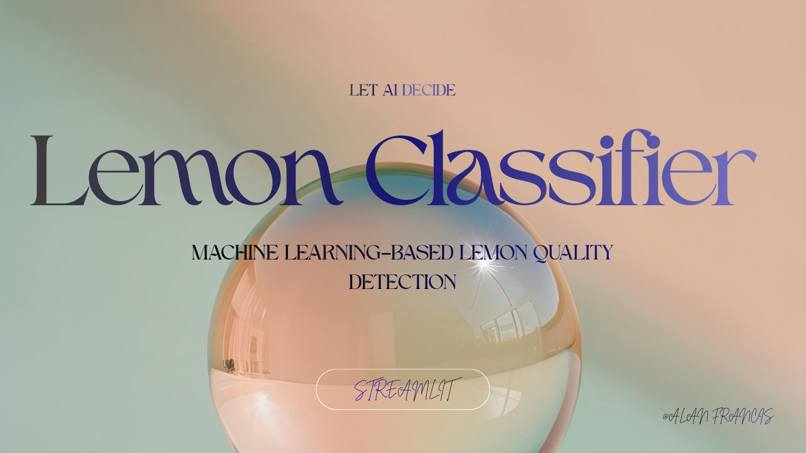
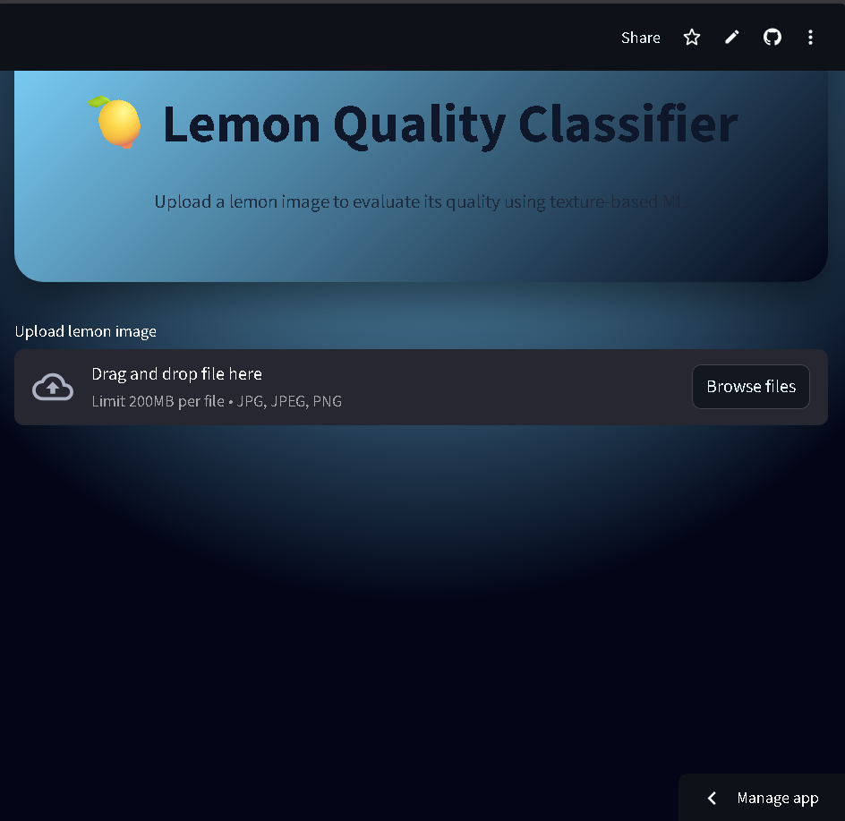
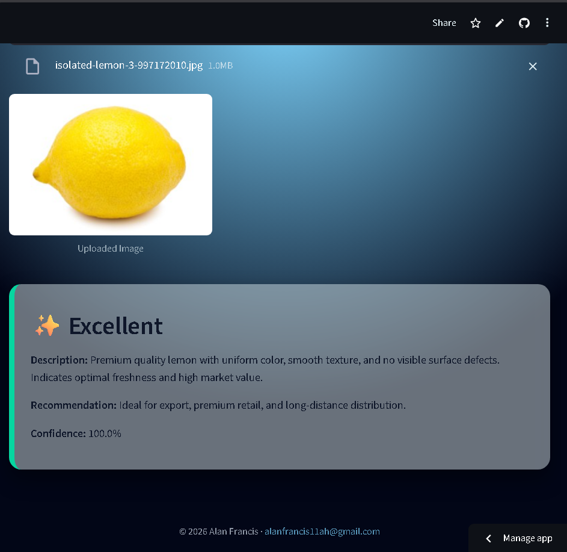

<div align="center">
  
  
  
  
  
  
  
  
</div>

## 🍋 Lemon Quality Classifier 

The Lemon Classifier is a lightweight web application designed to automatically classify images of lemons. Utilizing a pre-trained deep learning model, it provides a user-friendly interface for uploading images and receiving instant classification results. This project serves as a practical example of deploying a machine learning model for image recognition within a Flask-based web environment, ideal for quality control, educational purposes, or simply demonstrating ML inference.

## ✨ Features

- **Machine Learning–Based Predictions**  
  Implements a supervised ML pipeline with **Haralick texture features** and a **Scikit-learn      classifier**.
- **Computer Vision Feature Extraction**  
  Extracts texture and intensity-based features using **Mahotas** before classification.
- **Real-Time Inference**  
  Provides instant predictions immediately after image upload.
- **Simple & Interactive Web Interface**  
  Clean, minimal UI designed for demonstrations and easy use.
- **Modular & Reusable ML Pipeline**  
  Enables easy retraining, feature tuning, or classifier replacement.


## 📌 Prerequisites

Before running the Lemon Quality Classifier, ensure the following requirements are met:

- **Python 3.13.x or higher**
- **Conda or Miniconda** (recommended for environment management)
- **Mahotas** (for Haralick texture feature extraction)
- Familiarity with **Scikit-learn**, **NumPy**, and **Pandas**

### Installation

1.  **Clone the repository**
    ```bash
    git clone https://github.com/alanfrancis765/lemon_Classifier_IBM
    ```

2.  **Install dependencies**
    ```bash
    pip install -r requirements.txt
    ```

3.  **Ensure Model is Present**
    Make sure your pre-trained model file (e.g., `QDA_lemon.pkl`) is located in the `Model/` directory.
   
4.  **Start development server**
    ```bash
    python -m streamlit app.py
    ```

## 📁 Project Structure

```
lemon_Classifier_IBM/
├── Model/              
├── static/             
│   └── imges      
├── app.py                
├── requirements.txt    
├── LICENSE             
└── README.md            
```
**link to the website:**
[click here](https://lemonclassifieribm-ctrxazhlfcecxhvzxcrrgb.streamlit.app/)

## Screenshots



## 🤝 Contributing

We welcome contributions to improve the Lemon Classifier! If you have suggestions or want to contribute, please feel free to fork the repository and submit a pull request.
 branch of this repository.

## 📄 License

This project is licensed under the [MIT License](LICENSE) - see the LICENSE file for details.

## 🙏 Acknowledgments

-   Built as part of an IBM project/course.

## 📞 Support & Contact

-  Issues: [GitHub Issues](https://github.com/alanfrancis765/lemon_Classifier_IBM/issues)
---
<div align="center">

**⭐ Star this repo if you find it helpful!**

Made with ❤️ by [alanfrancis765](https://github.com/alanfrancis765)

</div>
```


